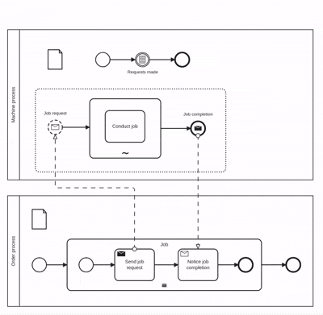
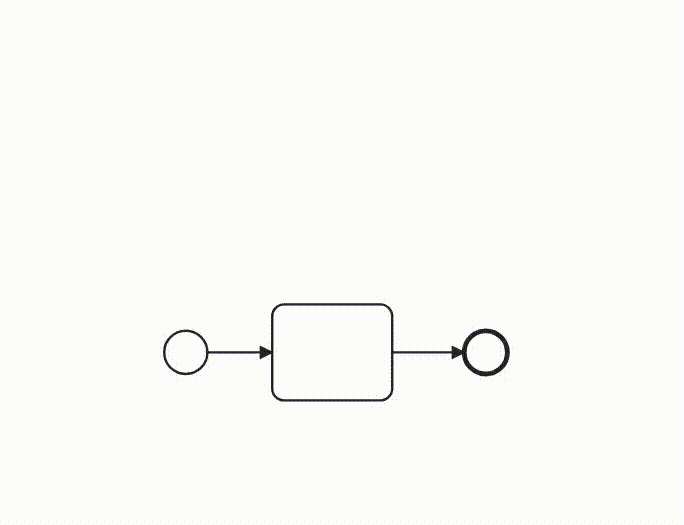
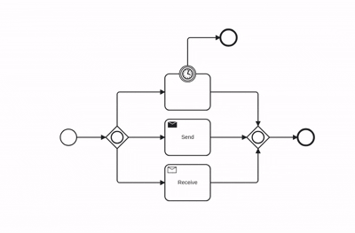

# bpmn-js-animation

Animation for BPMN powered by [bpmn-js](https://github.com/bpmn-io/bpmn-js).



## Motivation

This project allows to animate BPMN execution using tokens flowing through the model.
It is inspired by [bpmn-js-token-simulation](https://github.com/bpmn-io/bpmn-js-token-simulation), and reuses the fundamental token-flow animation, but takes a deliberately different approach:

- The main goal is an **API to programmatically animate token flows** during process execution (controlled by external execution engines).
- The design assumes that multiple instances of processes and activities run simultaneously and independently. To help viewers understand the instance-specific context, every instance is shown in its own environment, and viewers can scroll through these stacked environments by (shift) double-clicking them.
- Besides the API, an **Animator** and an interactive **Simulator** are provided.

## Installation

To use the library, add one of its modules to a bpmn-js viewer and import the stylesheet. The default export provides the animation API.

```javascript
import NavigatedViewer from 'bpmn-js/lib/NavigatedViewer';
import AnimationModule from 'bpmn-js-animation'; // the animation API (default export)

import 'bpmn-js-animation/assets/animation.css';

const viewer = new NavigatedViewer({
  container: '#canvas',
  additionalModules: [ AnimationModule ]
});

await viewer.importXML(diagramXML);
// drive tokens via viewer.get('animation') — see docs/animation.md
```

The `animation` API provides functions such as `createToken`, `advanceToken`, `forkToken`, `joinTokens`, and `consumeToken` (documented in [docs/animation.md](docs/animation.md)). Internally, these call low-level `primitives` documented in [docs/primitives.md](docs/primitives.md). Tokens are identified by BPMN node and instance label. For unambiguous identification there must never be two tokens at the same node with the same label (race-condition-free models satisfy this).

## Demo

The [demo](https://bpmn-os.github.io/bpmn-js-animation/) showcases a **Simulator** and an **Animator** based on the animation API.

Simulator and animator support the following BPMN elements: Tasks (including send / receive), exclusive / parallel / inclusive / complex and event-based gateways, sub-processes (expanded, and collapsed with drill in / out), multi-instance activities, boundary events, event sub-processes, terminate, error & escalation propagation, and link events.

Compensation, call activities, transaction sub-processes are not (yet) supported.

## Simulator

The **simulator** (`SimulatorModule`) allows users to control process execution with a buttonless interactive interface just by double-clicking tokens.

```javascript
import NavigatedViewer from 'bpmn-js/lib/NavigatedViewer';
import { SimulatorModule } from 'bpmn-js-animation';
import 'bpmn-js-animation/assets/animation.css';

const viewer = new NavigatedViewer({
  container: '#canvas',
  additionalModules: [ SimulatorModule ]
});

await viewer.importXML(diagramXML);
// no host code — drive it by double-clicking (start with a process start event)
```

- Spawn a new instance by double-clicking a process **start event**.
- Every activity goes through three stages (start, middle, end); at each, **double-click the token** to advance.
- **Double-click a process** to scroll between its instances (shift-double-click steps back).



- **Click** the sequence flow(s) out of a diverging gateway to choose them, then double-click the token.
- **Double-click** the token resting at a catching event to trigger it.



A token's animation tells you what it is waiting for:

| Cue | Meaning | What to do |
| --- | --- | --- |
| **bounce** | the token is waiting for **you** | **double-click it** to advance to its next step |
| **pulse** | a process / sub-process is **running** | nothing, it completes on its own once its contents finish |
| **pulse-pause** | a **decision** the simulator can't make without a data layer | pick / spawn, then double-click |

- **Diverging gateway** (exclusive / inclusive / complex): its outflows **dim**; **click** the flow(s) you want (one for exclusive, several for inclusive), then **double-click the token** to depart. A parallel or event-based gateway forks automatically.
- **Standard-loop activity**: at completion the outflows dim, **double-click** with nothing selected to run **another iteration**, or **click an outflow then double-click** to leave the loop.
- **Multi-instance activity**: the outer token **pulse-pauses** on the incoming flow, **double-click** it to spawn an activity-instance, then advance each instance token.

The simulator **records** the execution log (`startRecording` / `getRecording`). In the demo's **Simulation** panel you can **save** the log and **load** it back to replay with the animator.

## Animator

The **animator** plays back a recorded execution log that is either produced by the simulator or an external execution engine. 

```javascript
import NavigatedViewer from 'bpmn-js/lib/NavigatedViewer';
import { AnimatorModule } from 'bpmn-js-animation';
import 'bpmn-js-animation/assets/animation.css';

const viewer = new NavigatedViewer({
  container: '#canvas',
  additionalModules: [ AnimatorModule ]
});

await viewer.importXML(diagramXML);

// an array of token-flow events; see docs/execution-log.md for the format
const executionLog = [ /* ... */ ];

const animator = viewer.get('animator');
animator.autoFocus(true);
await animator.replay(executionLog);
```

See [docs/execution-log.md](docs/execution-log.md) for the execution log format.

## Simulation panel

`SimulationPanelModule` adds a **Simulation** tab to a [`bpmn-js-side-panel`](https://github.com/bpmn-os/bpmn-js-side-panel) that inspects the running tokens and hosts the controls. Add it alongside `SidePanelModule` and the simulator / animator you want to drive:

```javascript
import NavigatedViewer from 'bpmn-js/lib/NavigatedViewer';
import SidePanelModule from 'bpmn-js-side-panel';
import { SimulatorModule, AnimatorModule, SimulationPanelModule } from 'bpmn-js-animation';

import 'bpmn-js-side-panel/assets/side-panel.css';
import 'bpmn-js-animation/assets/animation.css';
import 'bpmn-js-animation/assets/simulation-panel.css';

const viewer = new NavigatedViewer({
  container: '#canvas',
  additionalModules: [ SimulatorModule, AnimatorModule, SidePanelModule, SimulationPanelModule ],
  sidePanel: { parent: '#side-panel' }
});
```

The panel:

- shows the **selected token(s)** and the **tokens at the selected node(s)** — or **all tokens** when nothing is selected; **click** a listed token to bring its stack to the front and select it, **double-click** to advance it;
- hosts **run / pause** + **animation speed** (Playback mode), **save / load** execution log, **refresh**, and an **auto-focus** toggle.

The panel no-ops when no side panel is present. Its run/pause is backed by `PlaybackModule` — a reusable playback controller (`play` / `pause` / `resume` / `stop`, with a `playback.changed` event) that wraps the animator and can be used on its own.

## Development

```sh
npm install     # deps (incl. dev: bpmn-js + vite for the demo)
npm run dev     # vite dev server — the demo (Simulator ⇄ Playback) at /
npm test        # karma + mocha in headless Chrome
npm run build   # production bundle of the demo → dist/ (sanity-checks all imports)
```

## Disclaimer

This project was built using Claude Code. The code itself has not been reviewed, only the visual behaviour has been validated.

## License

MIT

Copyright © Asvin Goel
